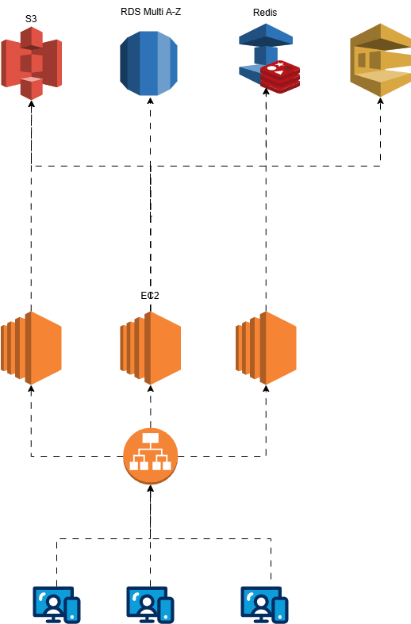

<div align="center">

# ☁️ Arquitetura e Automação AWS

**Bootcamp DIO × GFT — Fundamentos de Cloud com AWS**

[](https://aws.amazon.com/)
[](https://aws.amazon.com/step-functions/)
[](https://www.dio.me/)
[](https://www.gft.com/br/)
[](.)

</div>

---

## 📋 Sobre o Repositório

Este repositório documenta a jornada de aprendizado no **Bootcamp DIO × GFT — Fundamentos de Cloud com AWS**, reunindo dois laboratórios práticos implementados e validados na AWS:

- **Lab 1 — Arquitetura Intro DevOps:** montagem de infraestrutura cloud com os principais serviços AWS
- **Lab 2 — Workflows com Step Functions:** pipeline serverless completo com AWS Step Functions, Lambda, S3 e API Gateway — exportação de dados da PokeAPI para CSV com download automático

---

## 📁 Estrutura

```
devops-intro-arc/
├── README.md                              # Este arquivo
├── Arquitetura.gif                        # Diagrama da arquitetura (Lab 1)
├── ec2/
│   └── notes.md                           # EC2: conceitos, setup Node.js, SDK v3
├── cli/
│   └── notes.md                           # AWS CLI: configuração, comandos essenciais
├── eks/
│   └── notes.md                           # EKS: Kubernetes gerenciado, deploy Node.js
├── kms/
│   └── notes.md                           # KMS: criptografia, envelope encryption, SDK v3
├── cloudformation/
│   └── notes.md                           # CloudFormation: IaC, templates YAML, SDK v3
├── codedeploy/
│   └── notes.md                           # CodeDeploy: appspec.yml, hooks, scripts Node.js
└── step-functions/
    ├── notes.md                           # Step Functions: ASL, estados, lições práticas
    └── pokemon-csv-export/                # Projeto prático completo
        ├── state-machine.json             # Standard Workflow — pipeline de exportação
        ├── infrastructure.md              # Guia completo de implementação na AWS
        └── lambdas/
            ├── fetch-pokemon-list/        # Busca 1025 pokémons via pokemon-species e divide em batches
            ├── fetch-pokemon-batch/       # Busca detalhes em paralelo com retry e fallback para formas
            └── generate-csv/             # Gera CSV, faz upload S3 e retorna presigned URL
```

---

## 🏗️ Lab 1 — Arquitetura Intro DevOps

<div align="center">



_Diagrama da arquitetura montada durante o bootcamp_

</div>

### Serviços e Ferramentas Estudados

| Serviço / Ferramenta | O que é | Notas |
| -------------------- | ------- | ----- |
| **EC2** | Máquinas virtuais na nuvem | [ec2/notes.md](./ec2/notes.md) |
| **AWS CLI** | Interface de linha de comando para todos os serviços AWS | [cli/notes.md](./cli/notes.md) |
| **EKS** | Kubernetes gerenciado — orquestração de containers | [eks/notes.md](./eks/notes.md) |
| **KMS** | Gerenciamento de chaves de criptografia | [kms/notes.md](./kms/notes.md) |
| **CloudFormation** | Infraestrutura como Código (IaC) | [cloudformation/notes.md](./cloudformation/notes.md) |
| **CodeDeploy** | Deploy automatizado em EC2, Lambda e ECS | [codedeploy/notes.md](./codedeploy/notes.md) |
| **S3** | Armazenamento de objetos escalável | — |
| **RDS** | Banco de dados relacional gerenciado | — |
| **IAM** | Controle de identidade e acesso | — |
| **ELB** | Balanceador de carga elástico | — |

---

## ⚙️ Lab 2 — Workflows Automatizados com AWS Step Functions

AWS Step Functions é um serviço de **orquestração serverless** que coordena múltiplos serviços AWS em workflows visuais. Cada passo é um **estado** dentro de uma **State Machine** definida em ASL (Amazon States Language).

### Conceitos Fundamentais

| Conceito | Descrição |
| -------- | --------- |
| **State Machine** | Definição do workflow completo em ASL |
| **State (Estado)** | Unidade individual de trabalho |
| **Execution** | Uma instância de execução da State Machine |
| **ASL** | JSON que define estados e transições |
| **Standard Workflow** | Tipo assíncrono, auditável, até 1 ano de duração |
| **Express Workflow** | Tipo síncrono, até 5 minutos — não suporta `DescribeExecution` |

### Tipos de Estado

| Estado | Função |
| ------ | ------- |
| `Task` | Executa trabalho (Lambda, DynamoDB, SNS, etc.) |
| `Choice` | Ramificação condicional |
| `Wait` | Pausa por tempo ou até timestamp |
| `Parallel` | Executa branches simultaneamente |
| `Map` | Itera sobre uma lista com concorrência controlada |
| `Pass` | Transforma dados sem executar trabalho |
| `Succeed` | Termina com sucesso |
| `Fail` | Termina com erro |

Para conceitos detalhados, lições aprendidas na prática e armadilhas encontradas, veja [step-functions/notes.md](./step-functions/notes.md).

---

## 🔒 Projeto Prático — Pokemon CSV Export

Pipeline serverless completo implementado e validado na AWS. Exporta dados de 1025 pokémons da PokeAPI para um arquivo CSV com download automático no browser.

### Arquitetura

```
Browser
  │
  │  1. GET /pokemon/export
  ▼
API Gateway ──── Usage Plan (rate limit + API key)
  │
  │  StartExecution (assíncrono — retorna imediatamente)
  ▼
Step Functions Standard Workflow
  │
  ├── FetchPokemonList (Lambda)
  │     └─ Busca 1025 pokémons via /pokemon-species
  │     └─ Divide em 21 batches de 50
  │
  ├── FetchAllBatches (Map State, MaxConcurrency: 3)
  │     └─ FetchPokemonBatch (Lambda) × 21
  │           └─ Busca detalhes dos 50 pokémons em paralelo
  │           └─ Retry automático em 502/503/429 (PokeAPI)
  │           └─ Fallback para pokémons com formas (wormadam, deoxys, etc.)
  │
  └── GenerateCsv (Lambda)
        └─ Monta CSV com 1025 linhas
        └─ Upload para S3 (privado)
        └─ Gera presigned URL (válida 5 min)
  │
  │  2. GET /pokemon/export/status?arn=...  (polling)
  ▼
API Gateway
  │  DescribeExecution → quando SUCCEEDED retorna downloadUrl
  ▼
Browser acessa a presigned URL → download automático do CSV
```

### Serviços utilizados

| Serviço | Papel |
| ------- | ----- |
| **API Gateway** | Endpoints REST + Usage Plan para rate limiting |
| **Step Functions** | Orquestração do pipeline (Standard Workflow) |
| **Lambda** (×3) | Lógica de busca, transformação e geração do CSV |
| **S3** | Armazenamento temporário do CSV |
| **IAM** | Roles com permissões mínimas por serviço |

### Arquivos

| Componente | Arquivo |
| ---------- | ------- |
| State Machine (ASL) | [state-machine.json](./step-functions/pokemon-csv-export/state-machine.json) |
| Lambda — lista pokémons | [fetch-pokemon-list/index.mjs](./step-functions/pokemon-csv-export/lambdas/fetch-pokemon-list/index.mjs) |
| Lambda — detalhes batch | [fetch-pokemon-batch/index.mjs](./step-functions/pokemon-csv-export/lambdas/fetch-pokemon-batch/index.mjs) |
| Lambda — gera CSV | [generate-csv/index.mjs](./step-functions/pokemon-csv-export/lambdas/generate-csv/index.mjs) |
| Guia de implementação | [infrastructure.md](./step-functions/pokemon-csv-export/infrastructure.md) |

---

## 🎯 Objetivos de Aprendizagem

- [x] Entender os fundamentos de computação em nuvem com AWS
- [x] Criar e configurar serviços essenciais da AWS (EC2, S3, RDS, IAM, ELB)
- [x] Compreender conceitos de redes, segurança e escalabilidade
- [x] Montar uma arquitetura funcional como projeto prático
- [x] Gerenciar instâncias EC2 e hospedar aplicações Node.js com PM2
- [x] Usar a AWS CLI para automação e scripts de infraestrutura
- [x] Orquestrar containers com EKS (Kubernetes gerenciado)
- [x] Proteger dados com KMS usando envelope encryption
- [x] Descrever infraestrutura como código com CloudFormation
- [x] Automatizar deploys com CodeDeploy e estratégias de rollback
- [x] Compreender o modelo de orquestração com AWS Step Functions
- [x] Escrever State Machines em ASL (Amazon States Language)
- [x] Aplicar padrões de tratamento de erros (Retry, Catch, fallback)
- [x] Integrar Step Functions com Lambda, S3 e API Gateway
- [x] Implementar padrão assíncrono com StartExecution + DescribeExecution
- [x] Configurar IAM com permissões mínimas por tipo de recurso

---

## 📚 Contexto do Bootcamp

| | |
| --- | --- |
| **Programa** | Bootcamp GFT — Fundamentos de Cloud com AWS |
| **Plataforma** | [Digital Innovation One (DIO)](https://www.dio.me/) |
| **Parceiro** | GFT Technologies |
| **Foco** | Cloud Computing, AWS, DevOps, Step Functions |

---

## 🔗 Recursos de Referência

- [AWS Step Functions — Documentação oficial](https://docs.aws.amazon.com/step-functions/)
- [Amazon States Language (ASL)](https://states-language.net/spec.html)
- [Step Functions Workshop](https://catalog.workshops.aws/stepfunctions/en-US)
- [API Gateway — Integrações com serviços AWS](https://docs.aws.amazon.com/apigateway/latest/developerguide/api-gateway-api-integration-types.html)
- [AWS WAF — Documentação oficial](https://docs.aws.amazon.com/waf/)
- [PokeAPI](https://pokeapi.co/)

---

<div align="center">

Desenvolvido com dedicação durante o **Bootcamp DIO × GFT** ☁️

</div>
